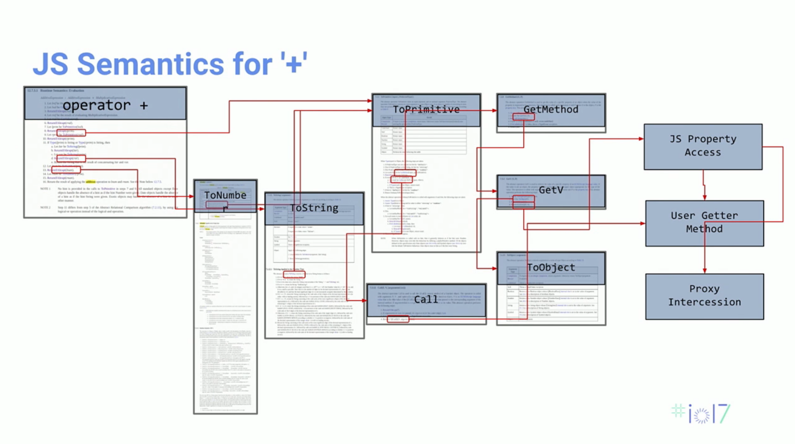
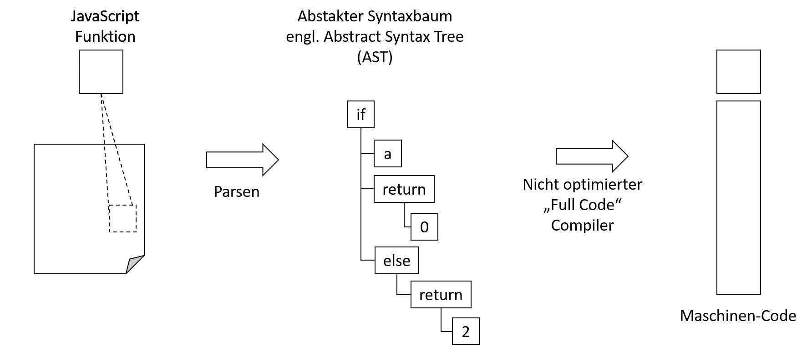

# Web Assembly 

## Lernziele 

Den Ursprung und die grundlegende Funktionsweise von WebAssembly verstehen.

## Hintergrund 

Niemand entwickelt _in_ WebAssembly. WebAssembly ist eine Web-Technologie, die es ermöglicht, Code, der in verschiedenen Programmiersprachen geschrieben wurde, mit nahezu nativer Leistung im Web auszuführen. Bei WebAssembly handelt es sich um ein sogenanntes »Compiler Target«, also ein binäres Anweisungsformat, das von modernen Webbrowsern ausgeführt werden kann. WebAssembly ist so konzipiert, dass es portabel, sicher, offen und debugbar ist und dabei mit der bestehenden Webplattform und JavaScript kompatibel ist. WebAssembly ermöglicht es Entwicklern, Anwendungen im Web bereitzustellen, die mittels herkömmlichen Web-Technologien so nicht oder nur sehr aufwendig umzusetzen waren.

## Compiler und Compiler Target 

Ein Compiler-Target Programm, das ein Compiler ausführbaren Code erstellen kann. Ein Compiler ist ein Programm, das eine Hochsprache wie Python oder Java in eine ausführbare Sprache wie Maschinen-Code oder Assembler übersetzt, die Rechnern verstanden und ausgeführt werden kann. Unterschiedliche Computersysteme oder Geräte können unterschiedliche Architekturen, Befehlssätze, Betriebssysteme oder Hardware-Funktionen aufweisen, daher muss ein Compiler wissen, wie er Code erzeugen kann, der für das spezifische Ziel kompatibel und optimiert ist. Zum Beispiel kann ein Compiler-Target für einen Windows-PC von einem Compiler-Target für ein Android-Smartphone unterschiedlich sein. Einige Compiler können mehrere Targets unterstützen, während andere für ein einzelnes Target spezialisiert sind.

| Compiler | Quellsprache | Compiler Target |
| --- | --- | --- |
| javac | Java | Java-Bytecode | 
| GCC | C | X86 Assembler |
| GAS | X86 Assembler| X86 Objekt-Code |
| Eiffel Compiler | Eiffel | C |
| Microsoft C# Compiler (csc.exe)  | C# | Microsoft Intermediate Language (MSIL) |
| WebAssembly Compiler | * | WebAssembly |

## Warum benötigen wir WebAssembly?

 Was wir eigentlich wollen ist Geschwindigkeit und bessere Performance. Was wir jedoch haben ist JavaScript im Browser als Flaschenhals. Was wäre, wenn wir eine bestehende App nehmen könnten und Sie mittels Cross-Compiling in den Browser bringen könnten? Vereinfacht ausgedrückt ist genau das WebAssembly. 

Der Ablauf für eine simple Addition (im Grunde eine einzelne Maschinenanweisung in Assembler) unter JavaScript ist wie folgt:

### Probleme mit JavaScript

* Moderne Engines versuchen die Semantik so kurz wie möglich zu halten 
* Was allerdings erreicht werden soll: ein »+« soll in eine einzige CPU-Instruktion konvertiert werden:

[^1]


# Geschwindigkeit

* Google hat untersucht, dass die Top Android Anwendungen allesamt in C++ entwickelt wurden
* Ursache für die Verwendung von C++: Performance- und Geschwindigkeitsvorteile 
* WebAssembly ist hier annähernd so schnell wie native Anwendungen 
  * Aktuell Browser-Engines erreichen den Faktor 1,2 trotz Sandbox und Sicherheitseinschränkungen 
  * In allen vier gängigen Browser-Engines verfügbar

---

# Plugins 

Weshalb nutzen wir keine Plugins im Browser?

Möglichkeiten wären z.B. Adobe Flash, Java Applets (JVM) oder Microsoft Silverlight. Probleme dieser Art von Technologien:

1. Sicherheitsprobleme: Plugins können Sicherheitslücken aufweisen, die von Angreifern ausgenutzt werden können, um Malware oder Viren auf einem Computer zu installieren.

2. Inkompatibilität: Plugins sind oft nur für bestimmte Browser und Betriebssysteme verfügbar und können nicht auf allen Plattformen ausgeführt werden. Dadurch kann es zu Inkompatibilitätsproblemen kommen, die dazu führen, dass eine Webseite nicht richtig funktioniert oder abstürzt.

3. Geschwindigkeit: Plugins können die Geschwindigkeit eines Browsers beeinträchtigen, da sie Ressourcen des Systems beanspruchen und den Browser verlangsamen können.

4. Veraltete Technologie: Viele Plugins verwenden veraltete Technologien und sind nicht mehr auf dem neuesten Stand. Dies kann dazu führen, dass sie nicht mehr mit aktuellen Browsern oder Betriebssystemen kompatibel sind und zu Problemen führen.

5. Abhängigkeit von Drittanbietern: Plugins werden oft von Drittanbietern entwickelt und gewartet. Wenn ein Plugin nicht mehr aktualisiert wird oder der Entwickler nicht mehr verfügbar ist, kann es schwierig sein, es zu reparieren oder zu ersetzen.

Aus diesen Gründen haben viele Browserhersteller beschlossen, Plugins nicht mehr zu unterstützen oder zu blockieren und auf moderne Webtechnologien wie HTML5, CSS3 und JavaScript zu setzen.


Viel wichtiger noch: Plugins laufen nicht auf Mobilgeräten. 

---

# Vorläufer

## Google Native Client


Google Native Client (NaCl) ist eine Sandbox-Technologie, die es ermöglicht, nativen Maschinencode auf einer Webplattform auszuführen. Es wurde von Google entwickelt und ist Teil des Chrome-Browsers allerdings ohne Unterstützung der Web-APIs.

Die Idee hinter NaCl ist es, eine sichere Möglichkeit zu schaffen, nativen Code in einem Webbrowser auszuführen, ohne dass dieser den Browser oder das Betriebssystem gefährdet. NaCl erlaubt es, Anwendungen in C oder C++ zu schreiben, die dann in einem speziellen Container innerhalb des Browsers ausgeführt werden können.

Code wird dabei in einem isolierten Speicherbereich ausgeführt, der es nicht erlaubt, auf andere Teile des Systems oder des Browsers zuzugreifen.

Im Gegensatz zu anderen Technologien wie JavaScript, die als interpretierte Sprache laufen, ermöglicht NaCl das Schreiben von nativem Maschinencode, der direkt auf der CPU des Computers ausgeführt wird. Dadurch wird eine höhere Leistung erreicht, was insbesondere bei der Verarbeitung von großen Datenmengen oder bei grafikintensiven Anwendungen von Vorteil sein kann.

Eine weitere Besonderheit von NaCl ist die Möglichkeit, dass der Maschinencode plattformübergreifend und somit auf verschiedenen Betriebssystemen ausgeführt werden kann. Das bedeutet, dass Anwendungen einmal geschrieben werden können und auf verschiedenen Systemen ausgeführt werden können, ohne dass zusätzlicher Aufwand für die Portierung erforderlich ist.

Das Grundprinzip ähnelt somit dem von WebAssembly. NaCl wurde 2020 von Google abgekündigt[^3]. 

## Mozilla: asm.js 

asm.js ist eine von Mozilla entwickelte Subset-Sprache von JavaScript, die eine stark typisierte und optimierte Form von JavaScript darstellt. asm.js wurde speziell für die Verwendung in Anwendungen entwickelt, die eine höhere Leistung erfordern, wie z.B. 3D-Spiele oder komplexe Simulationen.

asm.js besteht aus einer strikten Untermenge von JavaScript, die so geschrieben ist, dass sie von JavaScript-Engines als statischer, maschinenlesbarer Code ausgeführt werden kann. Der Code ist so strukturiert, dass er von optimierenden Compilern, einschließlich JIT-Compilern, schnell und effektiv in nativen Maschinencode übersetzt werden kann.

asm.js erfordert die Verwendung von bestimmten Sprachkonstrukten und die Einhaltung bestimmter Konventionen, um sicherzustellen, dass der Code in einer optimierten Form ausgeführt werden kann. Dazu gehören beispielsweise die Verwendung von bestimmten Datentypen wie "float" und "int", die Verwendung von Typed Arrays anstelle von herkömmlichen JavaScript-Arrays und die Vermeidung von dynamischer Typisierung und anderen JavaScript-Funktionen, die zu einer verringerten Leistung führen können.

Der Vorteil von asm.js besteht darin, dass er eine höhere Leistung als herkömmliches JavaScript bietet, da der Code durch die strikte Einhaltung von Regeln effektiver in Maschinencode übersetzt werden kann. Der Nachteil besteht jedoch darin, dass der Code schwerer zu schreiben und zu warten sein kann, da er spezielle Anforderungen an die Schreibweise hat.

asm.js wird normalerweise als Zwischencode verwendet, der von Compilern generiert wird, die von höheren Programmiersprachen wie C++ oder Rust in JavaScript übersetzen. Dies ermöglicht es Entwicklern, ihre vorhandenen Code-Bibliotheken in Webanwendungen zu verwenden, ohne dass sie den Code in JavaScript neu schreiben müssen.

Vorteile von asm.js zusammengefasst: 

  * Kompiliert C++ auf minimales JavaScript
  * JavaScript Engine kompiliert dies in relativ schnellen nativen Code
  * Problem: Starke unterschiede zwischen JavaScript Frameworks
  * Keine Cross-Browser Kompilierung 

```javascript
function add1(x) {
  x = x|0; // x : int
  return (x + 1)|0;
}
```


# JavaScript Lazy Compilation



## Exkurs: Abstract Syntax Tree 

Ein Abstrakter Syntaxbaum (AST) ist eine Datenstruktur, die verwendet wird, um den abstrakten syntaktischen Aufbau eines Programmcodes darzustellen. Im Gegensatz zum konkreten Syntaxbaum, der jede Details des Codes wie z.B. die Leerzeichen oder Kommentare enthält, enthält der AST nur die essenziellen Informationen, die zur Interpretation oder Ausführung des Codes benötigt werden.

Ein AST besteht aus Knoten, die jeweils einen Teil des Codes repräsentieren, und Kanten, die die Beziehungen zwischen den Knoten darstellen. Jeder Knoten im AST repräsentiert ein Konstrukt in der Programmiersprache, wie zum Beispiel einen Ausdruck, eine Anweisung, eine Funktion oder eine Variable. Jeder Knoten kann selbst Kinder haben, die wiederum Knoten im AST sind und den untergeordneten Teil des Codes darstellen.

Durch die Verwendung eines ASTs wird es einfacher, den Code zu analysieren, zu optimieren oder zu interpretieren. Compiler verwenden ASTs zum Beispiel, um den Code in eine Zwischensprache zu übersetzen oder um den Code zu optimieren, indem sie redundante Ausdrücke entfernen oder Schleifen verschachteln.

## Exkurs: JavaScript Lazy Compilation

Wie bereits gelernt, ist JavaScript eine interpretierte Sprache, die normalerweise Just-in-Time (JIT) kompiliert wird. Das bedeutet, dass der Code während der Ausführung des Programms in maschinenlesbaren Code übersetzt wird, was zu einer schnelleren Ausführung des Codes führen kann.

Eine Art der JIT-Kompilierung ist die sogenannte "Lazy Compilation", auch als "On-Demand-Compilation" bezeichnet. Hierbei wird der Code nicht sofort beim Laden des Programms kompiliert, sondern erst dann, wenn er tatsächlich benötigt wird.

Durch diese Methode wird verhindert, dass Code, der möglicherweise nie ausgeführt wird, unnötig kompiliert wird. Das spart Speicherplatz und Rechenleistung, da nur der Code kompiliert wird, der tatsächlich benötigt wird.

Ein Beispiel dafür ist die Verwendung von Funktionen in JavaScript. Wenn eine Funktion definiert wird, wird sie normalerweise nicht sofort kompiliert. Stattdessen wird sie erst dann kompiliert, wenn sie zum ersten Mal aufgerufen wird. Dies bedeutet, dass der Code, der innerhalb der Funktion definiert ist, nicht kompiliert wird, bis die Funktion tatsächlich aufgerufen wird.

Durch diese Methode kann JavaScript auch schneller starten, da die Kompilierung des Codes verzögert wird, bis er tatsächlich benötigt wird. Dies ist besonders nützlich für Anwendungen, die viel Code enthalten, aber nur einen Teil davon tatsächlich ausführen müssen.

Insgesamt bietet die Lazy Compilation in JavaScript eine Möglichkeit, den Code effizienter zu kompilieren und auszuführen, indem nur der benötigte Code kompiliert wird, was zu einer schnelleren Ausführung und einer besseren Nutzung von Ressourcen führen kann.

WebAssembly hingegen ist eine low-level Bytecode-Sprache, die speziell für den Einsatz im Web entwickelt wurde. WebAssembly wird normalerweise Ahead-of-Time (AOT) kompiliert, was bedeutet, dass der Code vor der Laufzeit in maschinenlesbaren Code übersetzt wird. Die Kompilierung von WebAssembly erfolgt normalerweise durch einen Compiler, der außerhalb des Webbrowser ausgeführt wird, und der dann den WebAssembly-Code erzeugt, der direkt vom Webbrowser ausgeführt wird.

Ein wichtiger Unterschied zwischen WebAssembly und JavaScript in Bezug auf Lazy Compilation besteht darin, dass WebAssembly normalerweise vollständig kompiliert wird, bevor er ausgeführt wird. Der gesamte Code wird also auf einmal kompiliert und der maschinelle Code wird dann direkt ausgeführt, ohne Verzögerung oder Lazy Compilation.

JavaScript hingegen kann Lazy Compilation verwenden, um nur den Code zu kompilieren, der tatsächlich benötigt wird. Dies ist aufgrund der höheren Abstraktionsebene von JavaScript möglich, da der Code normalerweise in einer höheren Sprache geschrieben wird und die Kompilierung auf den Maschinencode durch die JIT-Compiler verzögert werden kann.

Insgesamt bietet Lazy Compilation in JavaScript die Möglichkeit, nur den Code zu kompilieren, der tatsächlich benötigt wird, was zu einer effizienteren Nutzung von Ressourcen führen kann. WebAssembly hingegen kann durch seine niedrigere Ebene der Abstraktion schneller ausgeführt werden, ohne auf Lazy Compilation angewiesen zu sein.

---

# WebAssembly Ziele 

* Kompakt ⏩ Kleiner als minifizierte asm.js
  * aktuell ist WebAssembly Module kleiner als gezippte asm.js
* Einfache Verifikation ⏩ Sicherheit gewährleisten 
  * In einem Durchlauf durch den Bytecode sicherstellen, dass keine Zugriffe außerhalb der Grenzen des ausgeführten Codes stattfinden
    * JS Engines kompilieren Stück für Stück (abh. von Engine)
* Einfach zu kompilieren ⏩ Ein-Phasen-Compiler
* Erweiterbar ⏩ Neuer Bytcode und neue Typen
  * Vom Design her vorgesehen

---

# Sprachumfang von WebAssembly

* Datentypen
  * `void`, `i32`, `i64`, `f32`, `f64`
  * `i64` und `f64` können in C++ genutzt werden, nicht verfügbar in JS
* Speicher
  * lineare (zusammenhängender Speicher)
  * Hardware Boundaries bei 32Bit WebAssembly auf 64Bit-Systemen (keine Laufzeiteinbußen)

---

# Operationen & Kontrollfluß

* Operationen
  * i32: + - * / / << >> >>> etc
  * i64: + - * / / << >> >>> etc
  * f32: + - * / sqrt ceil floor 
  * f64: + - * / sqrt ceil floor 
  * conversions (Casting)
  * load store ch
  * call_direct call_indirect

* Strukturierter Kontrollfluss 
  * if loop block br switch

--- 

# WebAssembly ist eine »Stack Machine« 

Wenig überraschend: 

* »Stack Machine«
  * Funktionsweise Stack 
  * Populär für virtuelle Maschinen, da extrem einfach zu implementieren und in virtuellen Maschinen sehr schnell
* »Register-based Machine«
  * Funktionsweise via Register
  * Meistens Hardware vorbehalten (vgl. Vorlesung Betriebssysteme)
  * Vorteil: Kompilierter Code kann optimiert werden 
---

## Stack vs. Register (1)[^2] 

* Register-based 
  ```assembly
  LOAD R4,#2 ;Lade 2 in Register 4
  LOAD R5,#4 ;Lade 4 in Register 5
  ADD R4,R5  ;Addiere R4 and R5, speichere den Wert in R4
  ```

* Stack
  ```assembly
  PUSH #2 ;Push 2 auf den Stack
  PUSH #5 ;Push 5 auf den Stack
  ADD     ;Pop zwei Werte, addiere diese und push das Ergebnis auf den Stack
  ```

---

# Abschließende Betrachtung

## Web Assembly Raytracer

Die Webseite [https://mtharrison.github.io/wasm-raytracer/](https://mtharrison.github.io/wasm-raytracer/) enthält eine interaktive Demo eines Raytracing-Algorithmus, der in WebAssembly und JavaScript implementiert wurde. Die Demo zeigt die Leistungsunterschiede zwischen den beiden Versionen auf und ermöglicht es dem Benutzer, verschiedene Parameter des Algorithmus anzupassen. WebAssembly bietet eine höhere Leistung als JavaScript für rechenintensive Aufgaben wie Raytracing.

<iframe src="https://mtharrison.github.io/wasm-raytracer/" width="100%" height="1200px"></iframe>

Quelle: [https://mtharrison.github.io/wasm-raytracer/](https://mtharrison.github.io/wasm-raytracer/)


---

# Acknowledgments

Die Folien basieren auf einem Vortrag der Google I/O 2017[^1].


---


# Ressourcen

* WebAssembly auf GitHub: [https://github.com/WebAssembly](https://github.com/WebAssembly)
* WebAssembly Playground: [http://ast.run/](http://ast.run/)

# Referenzen

[^1]: [https://www.youtube.com/watch?v=6v4E6oksar0&t=241s](https://www.youtube.com/watch?v=6v4E6oksar0&t=241s)

[^2]: [https://www.quora.com/What-is-difference-between-register-machines-stack-machines](https://www.quora.com/What-is-difference-between-register-machines-stack-machines)

[^3]: [https://developer.chrome.com/docs/native-client/](https://developer.chrome.com/docs/native-client/) 