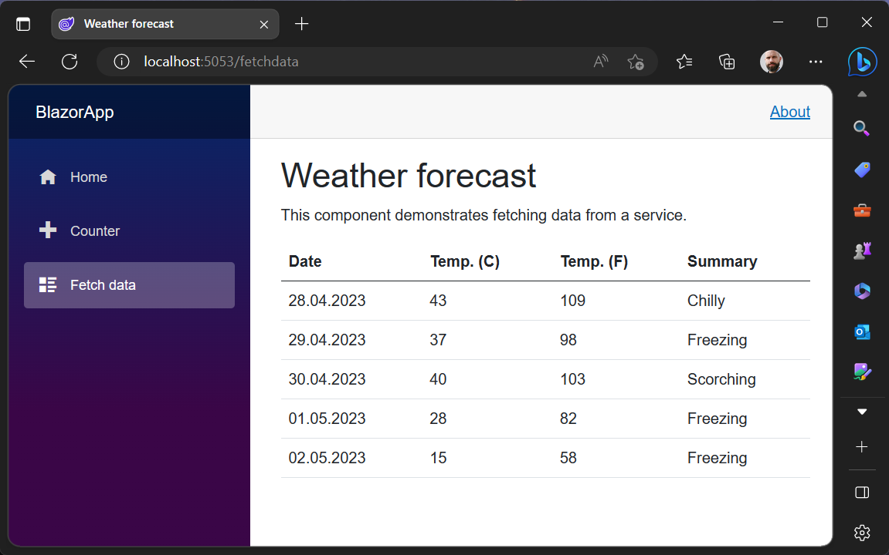

# Web Assembly Übung

Ziel dieser Übung it es, erste Erfahrung mit Microsoft Blazor zu erlangen und in diese Rahmen eine erste Web-Anwendung mit WebAssembly zu erstellen.

# Einführung 

Blazor ist ein Framework für die Erstellung interaktiver Webanwendungen mit .NET und C#. Mit Blazor können Web-Anwendungen mit C#-Code anstatt JavaScript erstellt werden. Blazor kann sowohl auf dem Server als auch auf dem Client ausgeführt werden. In diesem Tutorial lernen Sie, wie Sie eine einfache Blazor-Webanwendung erstellen und bereitstellen können.

Blazor nutzt HTML und CSS zur Darstellung einer Webanwendung verwendet. Der Unterschied zwischen einer Blazor-Client- und einer Serveranwendung besteht darin, dass bei der Clientanwendung der Code im Browser des Benutzers ausgeführt wird, während bei der Serveranwendung der Code auf dem Server ausgeführt wird.

Die Clientanwendung wird als WebAssembly-App ausgeführt und ist eine Single-Page-Anwendung. Die Serveranwendung wird als ASP.NET Core-App ausgeführt und verwendet SignalR zur Kommunikation zwischen Client und Server[^1].

# Übung 

Zur Vorbereitung der weiterführenden Aufgaben und zur Einarbeitung in Blazor arbeiten Sie das [Blazor Tutorial](https://dotnet.microsoft.com/en-us/learn/aspnet/blazor-cli-tutorial/intro) und erstellen die unten gezeigte Anwendung[^2]. 

# Referenzen 

[^1]: Hosten und Bereitstellen Blazor Server: [https://learn.microsoft.com/de-de/aspnet/core/blazor/host-and-deploy/server?view=aspnetcore-7.0](https://learn.microsoft.com/de-de/aspnet/core/blazor/host-and-deploy/server?view=aspnetcore-7.0)

[^2]: Blazor Tutorial - Build your first Blazor app: [https://dotnet.microsoft.com/en-us/learn/aspnet/blazor-cli-tutorial/intro](https://dotnet.microsoft.com/en-us/learn/aspnet/blazor-cli-tutorial/intro)